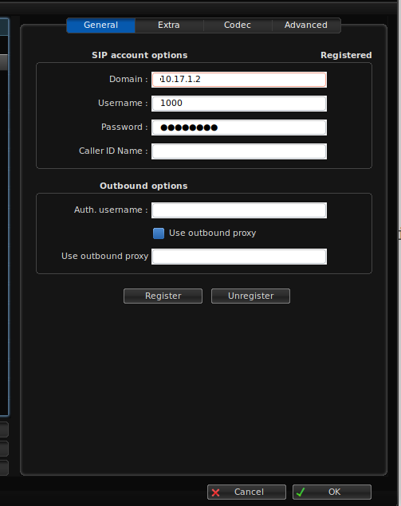

# Pré-requisitos

1 - Possuir um servidor com instalação do Asterisk 11.15.0 com CDR em realtime (Mysql)

2 - Notebook com qualquer distribuição linux (caso seja diferente do Ubuntu 22.04 LTS, verifique como irá instalar o SIPp em sua distro.


# Ambiente

 - Cliente

|Recurso|Valor|
|--|--|
|Tipo|Notebook|
|Modelo| Dell Vostro 5490|
|S.O|Ubuntu 22.04.1 LTS|
|Software utilizado no teste| SIPp|

 - Servidor

|Recurso|Valor|
|--|--|
|Tipo|Appliance/Servidor|
|Modelo|EBS Server Khomp|
|Processador| Intel(R) Celeron(R) CPU  J1800  @ 2.41GHz (2 cores, 2 threads)|
|Memória| 4GB|
|Discos| 1 disco SSD de 32GB + 1 disco 500GB SATA II, 5400RPM|
|Placa de rede| Realtek PCI-e 1Gbps|
|Sistema operacional| Centos 6.5|
|Sistema de arquivos| ext4|
|Versão do Asterisk|11.15.0|


# Instalação do SIPp no Ubuntu 22.04.1 LTS e configuração
  
```bash
 apt install git sip-tester -y
 git clone https://github.com/beneditomarques/basic-asterisk-training.git
 cd basic-asterisk-training/dimensionamento-de-hardware/
 ```

# Configuração no Asterisk

 - **extensions.conf**

```
[sipp-peformance-test]
exten => 100,1,Answer()
 same =>     n,Echo()
 same =>     n,Hangup()
```  

- sip.conf

```
[sipp]
type=friend
host=dynamic
context=sipp-peformance-test
insecure=invite,port


[1000]
type=friend
host=dynamic
secret=1000@123
context=sipp-peformance-test
insecure=invite,port
```

# Configuração no cliente


 - [Zoiper](https://www.zoiper.com/en/voip-softphone/download/zoiper3/providers)




# Descrição

1 - Antes de executar o SIPp, faça uma ligação para o número 100. Você deverá ficar ouvindo a própria voz (aplicação Echo())

2 - Depois execute o SIPp de acordo com cada cenário. O SIPp irá efetuar discagens para o Asterisk utilizando 2 cenários: o cenário uac_scenario_01.xml que contém a discagem com o codec G711A, e o cenário uac_scenario_02.xml contendo a discagem com o codec G729A. Cada ligação tem duração de 90s (1 minuto e meio), e ao final o SIPp envia o dígito 1 (DTMF) e encerra a chamada no Asterisk.


 # Efetuando o teste

<h3>Cenário 1</h3>  

|Recurso|Valor|
|--|--|
|Codec|G711A| 
|Gravação de chamadas| desativado|
|Bilhetagem com banco de dados| desativada|
|CAPS| 20|
|Duração das chamadas| 90s| 

 - **extensions.conf**

```
[sipp-peformance-test]
exten => 100,1,Answer()
 same =>     n,Echo()
 same =>     n,Hangup()
``` 

```bash
udemy@Vostro-5490:~/basic-asterisk-training/dimensionamento-de-hardware # sipp -s 100 10.17.1.2:5060 -sf uac_scenario_01.xml -i 10.17.1.3 -r 20 -l <número de chamadas>
```

 **Resultado**: A qualidade se mantém estável até 350 chamadas simultâneas. 
 
 - Com 400 chamadas: mais de 200 retransmissões, CPU acima de 70%, MOS em 2, Sistema travando (load acima de 20)
 - Com 380 chamadas: mais de 64 retransmissões, CPU acima de 70%, MOS em 4, Sistema sem travamentos (load acima de 15)
 - Com 350 chamadas: 5 retransmissões, CPU abaixo de 70%, MOS em 4, Sistema sem travamentos (load pouco acima de 2)


<h3>Cenário 2</h3>  

|Recurso|Valor|
|--|--|
|Codec|G729A| 
|Gravação de chamadas| ativado|
|Bilhetagem com banco de dados| ativada|
|CAPS| 20|
|Duração das chamadas| 90s| 


 - **extensions.conf**

```
[sipp-peformance-test]
exten => 100,1,Answer()
 same =>     n,Echo()
 same =>     n,Hangup()
``` 

```bash
udemy@Vostro-5490:~/basic-asterisk-training/dimensionamento-de-hardware # sipp -s 100 10.17.1.2:5060 -sf uac_scenario_02.xml -i 10.17.1.3 -r 20 -l <número de chamadas>
```

 **Resultado**: A qualidade se mantém estável até 100 chamadas simultâneas. 
 
  - Com 350 chamadas: milhares de retransmissões, CPU quase em 100%, MOS em 2, Sistema totalmente travado (load pouco acima de 132)
  - Com 150 chamadas: sem retransmissões, CPU quase em 100%, MOS em 3, Sistema lento (load pouco acima de 60)  
  - Com 100 chamadas: sem retransmissões, CPU abaixo de 70%, MOS em 4, Sistema estável (load abaixo de 1) 


<h3>Cenário 3</h3>  

|Recurso|Valor|
|--|--|
|Codec|G729A| 
|Gravação de chamadas| desativado|
|Bilhetagem com banco de dados| desativada|
|CAPS| 20|
|Duração das chamadas| 90s| 


 - **extensions.conf**

```
[sipp-peformance-test]
exten => 100,1,Answer()
 same =>    n,MixMonitor(/var/spool/asterisk/monitor/${EPOCH}/${EPOCH}.wav49,a)
 same =>    n,Set(CDR(monitor)=/var/spool/asterisk/monitor/${EPOCH}/${EPOCH}.WAV)
 same =>    n,Echo()
 same =>    n,Hangup()
``` 


```bash
udemy@Vostro-5490:~/basic-asterisk-training/dimensionamento-de-hardware # sipp -s 100 10.17.1.2:5060 -sf uac_scenario_02.xml -i 10.17.1.3 -r 20 -l <número de chamadas>
```

 **Resultado**: A qualidade se mantém estável até 350 chamadas simultâneas. 
 
 - Com 400 chamadas: mais de 230 retransmissões, CPU acima de 70%, MOS em 2, Sistema travando (load acima de 25)
 - Com 380 chamadas: mais de 70 retransmissões, CPU acima de 70%, MOS em 4, Sistema sem travamentos (load acima de 20)
 - Com 350 chamadas: 5 retransmissões, CPU abaixo de 70%, MOS em 4, Sistema sem travamentos (load pouco acima de 3)


<h3>Cenário 4</h3>  

|Recurso|Valor|
|--|--|
|Codec|G729A| 
|Gravação de chamadas| desativado|
|Bilhetagem com banco de dados| desativada|
|CAPS| 50|
|Duração das chamadas| 90s| 


 - **extensions.conf**

```
[sipp-peformance-test]
exten => 100,1,Answer()
 same =>    n,MixMonitor(/var/spool/asterisk/monitor/${EPOCH}/${EPOCH}.wav49,a)
 same =>    n,Set(CDR(monitor)=/var/spool/asterisk/monitor/${EPOCH}/${EPOCH}.WAV)
 same =>    n,Echo()
 same =>    n,Hangup()
``` 

```bash
udemy@Vostro-5490:~/basic-asterisk-training/dimensionamento-de-hardware # sipp -s 100 10.17.1.2:5060 -sf uac_scenario_02.xml -i 10.17.1.3 -r 50 -l <número de chamadas>
```

 **Resultado**: A qualidade se mantém estável até 70 chamadas simultâneas. 
 
  - Com 100 chamadas: sem retransmissões, CPU abaixo de 70% (com picos acima de 70%), MOS em 4, Sistema normal (porém load acima de 28)       
  - Com 70 chamadas: sem retransmissões, CPU abaixo de 70%, MOS em 4, Sistema normal (load pouco acima de 2)


